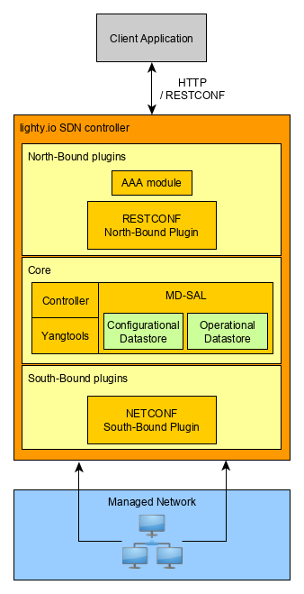

# Lighty RNC application
Lighty Restconf Netconf application allows to easily initialize, start and use most used OpenDaylight services and optionally add custom business logic.

Most important lighty.io components used are:
- [lighty.io controller](https://github.com/PANTHEONtech/lighty/tree/master/lighty-core/lighty-controller)
  provides core ODL services (like MDSAL, yangtools, global schema context,...) that are required
  for other services or plugins.
- [RESTCONF northbound plugin](https://github.com/PANTHEONtech/lighty/tree/master/lighty-modules/lighty-restconf-nb-community)
  provides the RESTCONF interface that is used to communicate with the application using the RESTCONF protocol over the HTTP.
- [NETCONF southbound plugin](https://github.com/PANTHEONtech/lighty/tree/master/lighty-modules/lighty-netconf-sb)
  enables application to connect to the NETCONF devices using the NETCONF protocol and read/write configuration
  from them or execute RPCs.
- [AAA module](https://github.com/PANTHEONtech/lighty/tree/master/lighty-modules/lighty-aaa) provides authorization,
  authentication and accounting which for example enables to use Basic Authentication for RESTCONF northbound interface.
  This module is optional and can be turned ON/OFF using application configuration.



## Prerequisites
In order to build and start the RNC lighty.io application locally, you need:
* Java 11 or later 
* maven 3.5.4 or later
* optionally docker for creating and running docker images

## Build and start
To build and start the RNC lighty.io application in the local environment follow these steps:

1. Build the application using this maven command:  
   `mvn clean install -pl :lighty-rnc-app -am`

2. Unpack the application ZIP distribution created in the _lighty-rnc-app/target_ called
   `lighty-rnc-app-<version>-bin.zip`
   
3. Start the application by running it's _.jar_ file:  
   `java -jar lighty-rnc-app-<version>.jar`
   
4. To start the application with custom configuration use command:  
   `java -jar lighty-rnc-app-<version>.jar /path/to/config-file`  
   
   Example configuration is located on following path:  
   `lighty-rnc-app/src/main/resources/configuration.json`

5. If the application was started successfully, then a log similar should be present in the console:  
   `INFO [main] (Main.java:80) - RNC lighty.io application started in 5989.108ms`

6. Test the RNC lighty.io application. Default RESTCONF port is `8888`

7. The default credential for http requests is login:`admin`, password: `admin`. 
To manipulate user's credentials [idmtool](https://docs.opendaylight.org/projects/aaa/en/stable-magnesium/user-guide.html#idmtool) can be used:
    - create new `etc` directory and create there `org.ops4j.pax.web.cfg` file
    - add this two lines in the `org.ops4j.pax.web.cfg` file: 
       
       `org.osgi.service.http.port.secure = 8888`
       
       `org.osgi.service.http.secure.enabled = true`
        
        where `8888` - default RESTCONF port. It can be different according to your configuration.
    - download `idmtool.py` script from AAA project github repository and place downloaded file into `etc` directory
        
        `curl -O https://raw.githubusercontent.com/opendaylight/aaa/stable/magnesium/aaa-shiro/impl/src/main/resources/idmtool.py`
    - run script (latest python version must be installed)
    
        `python etc/idmtool.py -h`
        
        This will show you the list of possible commands that can be used.
        If you are using self generated ssl sertificate, you should use `-k` argument.
        For example, to show the list of all users:
      
        `python etc/idmtool.py -k admin list-users`
      
        where `admin` - user name (the default name); `list-users` command to show all users.
        It will ask to write password for `admin` user (the default one is `admin`)    
    
    Also, it is possible to configure user's credentials via [REST](https://docs.opendaylight.org/projects/aaa/en/latest/user-guide.html#configuration-using-the-restful-web-service)

8. For using ssl connection the correct certificate must be used.
By default, a test certificate is used (`lighty-rnc-module/src/main/resources/keystore/lightyio.jks`).
For generating a JKS file `keytool` utility can be used. Example of command to regenerate keystore with self-signed certificate:

```
keytool -genkey -alias lightyio -keyalg RSA -keystore lightyio.jks -keysize 2048 -ext san=dns:lighty.io,dns:lightyio,dns:restconf.lighty.io,dns:management.lighty.io,dns:localhost,ip:127.0.0.1,ip:0.0.0.0 -validity 2000
```
which creates new `lightyio.jks` keystore file with hostnames: `lighty.io, lightyio, restconf.lighty.io, management.lighty.io, localhost`

The path to correct certificate can be placed in `configuration.json file` (`restconf.keyStoreFile`)
Also you need to provide file type for this certificate (`restconf.keyStoreType`) and password (`restconf.keyStorePassword`)